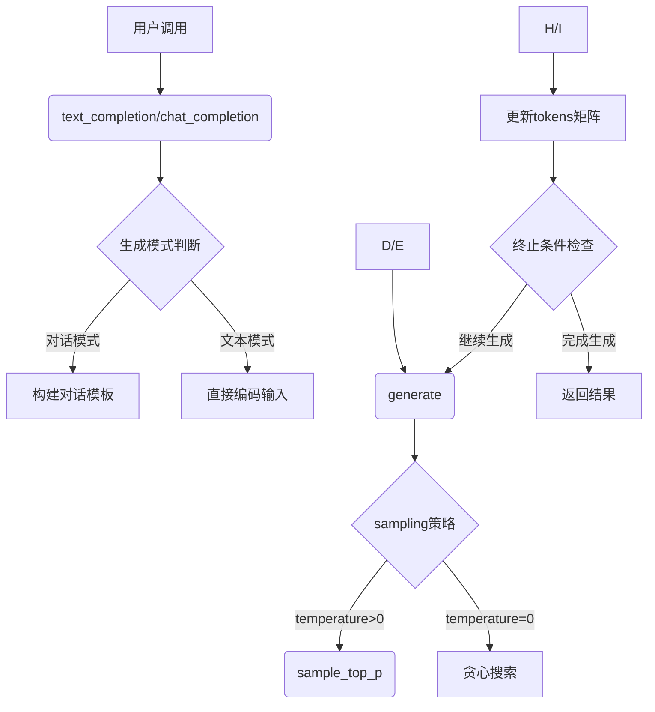

# 核采样-词元的对数概率-提示次元 概念

1. ### 核采样的概率阈值（top_p）：

1. 核采样（Nucleus Sampling 或 Top-p Sampling）是一种文本生成策略，用于在保持文本质量的同时引入适度的随机性。
```python
top_p: float = 0.9  # 核采样阈值
```
- 也称为"nucleus sampling"或"top-p sampling"
- 它通过只保留累积概率达到阈值p的最小token集合来进行采样
- 工作方式：
  ```python
  # 例如，假设有以下token及其概率：
  # "the": 0.5    (50%)
  # "a":   0.3    (30%)
  # "an":  0.1    (10%)
  # "this": 0.07  (7%)
  # "that": 0.03  (3%)
  
  # 如果 top_p = 0.9，则只会从前三个token中选择
  # 因为 0.5 + 0.3 + 0.1 = 0.9
  ```

2. ### 词元的对数概率（logprobs）：
```python
logprobs: bool = False  # 是否返回对数概率
```
- 词元（token）是文本被分词后的基本单位
- 对数概率是模型对每个生成词元的确信度的度量
- 例子：
  ```python
  # 原始概率：0.5
  # 对数概率：ln(0.5) ≈ -0.693
  
  # 当logprobs=True时的返回值示例：
  tokens = ["Hello", "world"]
  logprobs = [-0.2, -0.5]  # 对应每个token的对数概率
  ```
  
  #### 使用词元对数的原因：
  
  计算词元的对数概率（logprobs）有几个重要原因：
  
  1. 数值稳定性：
  ```python
  # 直接使用概率值可能会导致数值下溢
  prob1 = 0.0001
  prob2 = 0.0002
  prob_product = prob1 * prob2  # = 0.00000002 (可能下溢为0)
  
  # 使用对数概率可以避免这个问题
  log_prob1 = log(0.0001)  # = -9.21
  log_prob2 = log(0.0002)  # = -8.52
  log_prob_sum = log_prob1 + log_prob2  # = -17.73 (数值稳定)
  ```
  
  2. 便于计算序列概率：
  ```python
  # 假设我们要计算句子"我喜欢你"的概率
  sentence = "我喜欢你"
  
  # 使用普通概率需要连乘（容易造成下溢）
  normal_prob = P("我") * P("喜欢") * P("你")  # 可能变得非常小
  
  # 使用对数概率只需要相加
  log_prob = log(P("我")) + log(P("喜欢")) + log(P("你"))  # 数值更稳定
  ```
  
  3. 方便评估生成质量：
  ```python
  def evaluate_generation_quality(generated_text, logprobs):
      # 平均对数概率作为生成质量的度量
      avg_logprob = sum(logprobs) / len(logprobs)
      
      # 困惑度（perplexity）计算
      perplexity = exp(-avg_logprob)
      
      return {
          "avg_logprob": avg_logprob,
          "perplexity": perplexity
      }
  ```
  
  4. 调试和分析模型行为：
  ```python
  def analyze_generation(tokens, logprobs):
      # 找出模型最不确定的词（概率最低的）
      lowest_prob_indices = sorted(
          range(len(logprobs)), 
          key=lambda i: logprobs[i]
      )
      
      print("最不确定的词：")
      for idx in lowest_prob_indices[:3]:
          print(f"Token: {tokens[idx]}, LogProb: {logprobs[idx]}")
  ```
  
  5. 在实际应用中：
  ```python
  # 生成文本时记录对数概率
  response = model.generate(
      prompt="请介绍一下你自己",
      logprobs=True  # 启用对数概率记录
  )
  
  # 分析生成结果
  for token, logprob in zip(response.tokens, response.logprobs):
      confidence = exp(logprob)  # 转换回原始概率
      if confidence < 0.1:  # 找出低置信度的词
          print(f"低置信度词: {token}, 概率: {confidence:.2%}")
  ```
  
  主要优势：
  1. 数值计算更稳定
  2. 便于序列概率的计算
  3. 方便模型质量评估
  4. 有助于调试和分析
  5. 可以用于识别生成过程中的不确定性
  
  实际应用场景：
  1. 模型评估和比较
  2. 生成质量监控
  3. 模型行为分析
  4. 生成策略优化

3. ### 提示词元（echo）：
```python
echo: bool = False  # 是否包含原始输入
```
- 控制是否在输出中包含输入的提示文本
- 示例：
  ```python
  prompt = "请问今天"
  
  # echo=True时：
  输出 = "请问今天天气很好"  # 包含原始输入
  
  # echo=False时：
  输出 = "天气很好"  # 只包含新生成的内容
  ```

实际使用示例：
```python
response = model.generate(
    prompt_tokens=[[1, 2, 3]],
    max_gen_len=50,
    temperature=0.7,
    top_p=0.9,        # 90%的概率质量
    logprobs=True,    # 返回概率信息
    echo=True         # 包含输入提示
)

# 返回值可能如下：
generated_tokens = [[1, 2, 3, 4, 5]]  # 包含原始输入[1,2,3]
token_logprobs = [[-0.1, -0.2, -0.3, -0.4, -0.5]]  # 对应的对数概率
```

这些参数共同控制了文本生成的行为和输出格式，使模型生成的文本更可控和可分析。


# 为什么分词后的提示列表的长度是当前批次的大小 bsz = len(prompt_tokens)

`bsz = len(prompt_tokens)` 是因为 `prompt_tokens` 的结构是一个二维列表，其中：

1. 外层列表的长度代表批次大小（batch size）
2. 内层列表代表每个提示文本的token序列

让我用例子说明：
```python
# 假设有两个输入提示文本：
prompt_tokens = [
    [1, 2, 3, 4],    # 第1个提示的token序列
    [5, 6, 7, 8]     # 第2个提示的token序列
]

bsz = len(prompt_tokens)  # = 2，因为有两个提示序列
```

这种设计的原因：
1. 批处理效率：
```python
# 可以同时处理多个输入
tokens = torch.full((bsz, total_len), pad_id, dtype=torch.long, device="cuda")
for k, t in enumerate(prompt_tokens):
    tokens[k, : len(t)] = torch.tensor(t, dtype=torch.long, device="cuda")
```

2. 并行计算：

```238:240:llama/generation.py
        params = self.model.params
        bsz = len(prompt_tokens)
        assert bsz <= params.max_batch_size, (bsz, params.max_batch_size)
```

这段代码检查批次大小是否在模型允许的范围内。

3. 内存管理：
- 每个批次的大小直接影响GPU内存使用
- 通过限制批次大小来防止内存溢出

4. 实际应用场景：
```python
# 例如，同时处理多个用户的请求
prompts = [
    "今天天气如何？",    # 用户1的提问
    "请介绍一下自己",    # 用户2的提问
    "写一首诗"          # 用户3的提问
]

# 转换为token后的形式
prompt_tokens = [
    [101, 234, 567],   # 用户1提问的token序列
    [102, 345, 678],   # 用户2提问的token序列
    [103, 456, 789]    # 用户3提问的token序列
]

bsz = len(prompt_tokens)  # = 3，表示同时处理3个用户的请求
```


# torch.full和 torch.tensor是干嘛的

1. `torch.full`:
```python
# torch.full(size, fill_value, ...)
# 创建一个指定大小的张量，所有元素都填充为同一个值

# 例子1：创建一个2x3的全0张量
zeros = torch.full((2, 3), 0)
print(zeros)
# 输出：
# [[0, 0, 0],
#  [0, 0, 0]]

# 例子2：创建一个填充了pad_id的张量
tokens = torch.full(
    size=(bsz, total_len),  # 形状：(批次大小, 序列长度)
    fill_value=pad_id,      # 填充值
    dtype=torch.long,       # 数据类型
    device="cuda"           # 设备
)
```


2. `torch.tensor`:
```python
# torch.tensor(data, ...)
# 从Python数据结构（如列表）创建张量

# 例子1：从列表创建张量
data = [1, 2, 3]
t = torch.tensor(data)
print(t)  # tensor([1, 2, 3])

# 例子2：创建2D张量
data = [[1, 2], [3, 4]]
t = torch.tensor(
    data,
    dtype=torch.long,    # 数据类型
    device="cuda"        # 设备
)
print(t)
# 输出：
# [[1, 2],
#  [3, 4]]
```


3. 在Llama代码中的使用：
```python
# 1. 使用torch.full预分配空间并填充pad_id
tokens = torch.full((bsz, total_len), pad_id, dtype=torch.long, device="cuda")
# 创建了一个大的、填充了pad_id的张量

# 2. 使用torch.tensor转换实际序列
for k, t in enumerate(prompt_tokens):
    # 将Python列表t转换为CUDA张量
    tokens[k, : len(t)] = torch.tensor(t, dtype=torch.long, device="cuda")
```


主要区别：
1. `torch.full`:
   - 创建固定大小的张量
   - 所有元素相同
   - 常用于初始化或填充

2. `torch.tensor`:
   - 从现有数据创建张量
   - 元素可以不同
   - 常用于数据转换

使用场景：
```python
# 1. 初始化大矩阵
matrix = torch.full((1000, 1000), 0.0)  # 创建1000x1000的零矩阵

# 2. 转换输入数据
input_data = [1, 2, 3, 4]
tensor_data = torch.tensor(input_data)  # 转换为张量

# 3. 在Llama中的组合使用
tokens = torch.full((bsz, total_len), pad_id)  # 先创建填充矩阵
tokens[0] = torch.tensor([1, 2, 3])  # 再填入实际数据
```


# 将对话的每个消息编码为token，结果保存在`prompt_tokens`中

这段代码的作用是将对话（`dialog`）中的 **用户消息（`user`）** 和 **助手消息（`assistant`）** 按照特定格式编码为 **token 序列**，并将所有消息的 token 序列拼接成一个完整的列表。下面是对这段代码的详细解析：

---

### 代码功能
1. **对话格式处理**：
   - 将每对 `user` 和 `assistant` 消息组合成一个字符串，格式为：
     ```
     [INST] {用户消息内容} [/INST] {助手消息内容}
     ```
   - 例如：
     ```python
     user_msg = "Hello!"
     assistant_msg = "Hi! How can I help?"
     formatted_msg = "[INST] Hello! [/INST] Hi! How can I help?"
     ```

2. **编码为 token 序列**：
   - 使用分词器（`tokenizer`）将格式化后的字符串编码为 token 序列。
   - 每个字符串的编码结果是一个整数列表（`List[int]`），表示 token 的 ID。

3. **拼接所有 token 序列**：
   - 将所有消息对的 token 序列拼接成一个完整的列表（`List[int]`）。

---

### 代码分步解析

#### 1. **提取用户和助手消息**
```python
for prompt, answer in zip(dialog[::2], dialog[1::2])
```
- **`dialog[::2]`**：提取对话中所有 **偶数索引** 的消息（即 `user` 消息）。
- **`dialog[1::2]`**：提取对话中所有 **奇数索引** 的消息（即 `assistant` 消息）。
- **`zip(dialog[::2], dialog[1::2])`**：将 `user` 和 `assistant` 消息配对。

例如：
```python
dialog = [
    {"role": "user", "content": "Hello!"},
    {"role": "assistant", "content": "Hi! How can I help?"},
    {"role": "user", "content": "What's the weather today?"},
    {"role": "assistant", "content": "It's sunny!"}
]
```
提取结果：
```python
prompt = {"role": "user", "content": "Hello!"}
answer = {"role": "assistant", "content": "Hi! How can I help?"}
```

---

#### 2. **格式化消息**
```python
f"{B_INST} {(prompt['content']).strip()} {E_INST} {(answer['content']).strip()} "
```
- **`B_INST` 和 `E_INST`**：分别是 `[INST]` 和 `[/INST]`，用于标记用户消息的开始和结束。

- ```python
  # 假设 BOS=1, EOS=2
  text = "你好"
  
  # bos=True, eos=True
  tokens = tokenizer.encode(text, bos=True, eos=True)
  # 输出: [1, 3, 4, 2]  (假设 "你"=3, "好"=4)
  
  # bos=True, eos=False
  tokens = tokenizer.encode(text, bos=True, eos=False)
  # 输出: [1, 3, 4]
  
  # bos=False, eos=True
  tokens = tokenizer.encode(text, bos=False, eos=True)
  # 输出: [3, 4, 2]
  ```

- **`prompt['content']`**：用户消息的内容。

- **`answer['content']`**：助手消息的内容。

- **`strip()`**：去除消息内容前后的空白字符。

例如：
```python
formatted_msg = "[INST] Hello! [/INST] Hi! How can I help?"
```

---

#### 3. **编码为 token 序列**
```python
self.tokenizer.encode(formatted_msg, bos=True, eos=True)
```
- **`tokenizer.encode`**：将格式化后的字符串编码为 token 序列。
- **`bos=True`**：在序列开头添加 **BOS（Beginning of Sequence）** token，表示序列的开始。
- **`eos=True`**：在序列末尾添加 **EOS（End of Sequence）** token，表示序列的结束。

例如：
```python
token_sequence = [1, 2, 3, 4, 5]  # 假设编码结果为 [1, 2, 3, 4, 5]
```

---

#### 4. **拼接所有 token 序列**
```python
sum([...], [])
```
- **`sum`**：将多个列表拼接成一个列表。
- **`[]`**：初始值为空列表，用于累加所有 token 序列。

例如：
```python
token_sequences = [
    [1, 2, 3],  # 第一对消息的 token 序列
    [4, 5, 6]   # 第二对消息的 token 序列
]
result = sum(token_sequences, [])  # 结果为 [1, 2, 3, 4, 5, 6]
```

---

### 完整示例
假设对话如下：
```python
dialog = [
    {"role": "user", "content": "Hello!"},
    {"role": "assistant", "content": "Hi! How can I help?"},
    {"role": "user", "content": "What's the weather today?"},
    {"role": "assistant", "content": "It's sunny!"}
]
```

#### 处理过程
1. **提取消息对**：
   - 第一对：`prompt = "Hello!"`, `answer = "Hi! How can I help?"`
   - 第二对：`prompt = "What's the weather today?"`, `answer = "It's sunny!"`

2. **格式化消息**：
   - 第一对：`"[INST] Hello! [/INST] Hi! How can I help?"`
   - 第二对：`"[INST] What's the weather today? [/INST] It's sunny!"`

3. **编码为 token 序列**：
   - 第一对：`[1, 2, 3, 4, 5]`
   - 第二对：`[6, 7, 8, 9, 10]`

4. **拼接结果**：
   ```python
   dialog_tokens = [1, 2, 3, 4, 5, 6, 7, 8, 9, 10]
   ```

---

### 总结
这段代码的核心功能是将对话中的 `user` 和 `assistant` 消息按照特定格式编码为 token 序列，并将所有消息的 token 序列拼接成一个完整的列表。这种格式化的 token 序列可以直接输入到语言模型中进行推理或训练。


# 文件介绍

这个文件是 **文本生成的核心文件**，主要用于 **语言模型的推理和生成过程**，属于自然语言处理（NLP）中的 **文本生成任务**。它并不是直接处理数据收集、清洗、分词、标准化或特征提取等任务，而是专注于 **加载预训练模型、处理输入文本、控制生成过程**，并提供 **文本补全和对话生成** 的接口。

以下是文件的主要功能及其在 NLP 流程中的位置：

---

### 1. **文件的核心功能**
#### **(1) 加载预训练模型**
- 从指定的检查点目录加载预训练的 LLaMA 模型。
- 初始化分词器（Tokenizer），用于将文本编码为 token 序列，或将 token 序列解码为文本。
- 支持分布式训练和模型并行，以处理大规模模型。

#### **(2) 处理输入文本和对话**
- 支持两种输入形式：
  - **文本补全**：输入一段文本，模型生成后续内容。
  - **对话生成**：输入一组对话（包含用户和助手的消息），模型生成助手的回复。
- 对输入文本进行编码（将文本转换为 token 序列），并处理对话中的系统消息、用户消息和助手消息。

#### **(3) 控制生成过程**
- 通过参数控制生成过程：
  - **温度（temperature）**：控制生成文本的随机性。温度越高，生成结果越随机；温度越低，生成结果越确定。
  - **Top-p 采样（核采样）**：从概率最高的 token 中采样，直到累积概率超过阈值 `p`，以平衡生成结果的多样性和质量。
  - **最大生成长度（max_gen_len）**：限制生成文本的最大长度。
  - **对数概率（logprobs）**：返回每个生成 token 的对数概率，用于分析生成结果的可信度。

#### **(4) 提供文本补全和对话生成接口**
- **文本补全接口**（`text_completion`）：
  - 输入：一段文本提示（prompt）。
  - 输出：生成的补全文本。
- **对话生成接口**（`chat_completion`）：
  - 输入：一组对话（包含用户和助手的消息）。
  - 输出：助手的回复。

---

### 2. **在 NLP 流程中的位置**
这个文件属于 NLP 流程中的 **推理和生成阶段**，而不是数据预处理阶段。以下是 NLP 的典型流程，以及该文件在其中的位置：

#### **(1) 数据收集**
- 收集用于训练模型的原始文本数据（如对话数据、文章等）。
- **该文件不涉及数据收集**。

#### **(2) 数据清洗**
- 对原始文本进行清洗，去除噪声（如 HTML 标签、特殊符号等）。
- **该文件不涉及数据清洗**。

#### **(3) 分词**
- 将文本分割为单词或子词（subword）单元。
- **该文件使用预训练的分词器（Tokenizer）**，将输入文本编码为 token 序列。

#### **(4) 标准化**
- 对文本进行标准化处理（如小写转换、去除停用词等）。
- **该文件不涉及标准化**，但分词器可能包含一些标准化逻辑。

#### **(5) 特征提取**
- 将文本转换为数值特征（如词向量、token ID 等）。
- **该文件使用分词器将文本编码为 token ID 序列**，作为模型的输入。

#### **(6) 模型训练**
- 使用标注数据训练语言模型。
- **该文件不涉及模型训练**，而是加载预训练模型进行推理。

#### **(7) 推理和生成**
- 使用训练好的模型生成文本。
- **该文件的核心功能**，包括：
  - 加载预训练模型。
  - 处理输入文本和对话。
  - 控制生成过程（温度、Top-p 采样等）。
  - 提供文本补全和对话生成接口。

---

### 3. **文件的主要模块**
#### **(1) 模型加载与初始化**
- **`Llama.build`**：加载预训练模型和分词器，初始化分布式训练环境。
- **`Llama.__init__`**：初始化 Llama 实例，保存模型和分词器。

#### **(2) 文本生成**
- **`Llama.generate`**：核心生成逻辑，根据输入的 token 序列生成文本。
  - 支持温度控制和 Top-p 采样。
  - 返回生成的 token 序列及其对数概率（可选）。

#### **(3) 文本补全**
- **`Llama.text_completion`**：提供文本补全接口。
  - 输入：一段文本提示。
  - 输出：生成的补全文本。

#### **(4) 对话生成**
- **`Llama.chat_completion`**：提供对话生成接口。
  - 输入：一组对话（包含用户和助手的消息）。
  - 输出：助手的回复。

#### **(5) Top-p 采样**
- **`sample_top_p`**：实现 Top-p 采样，用于从概率分布中选择下一个生成的 token。

---

### 4. **总结**
这个文件是 **文本生成任务的核心实现**，专注于 **加载预训练模型、处理输入文本、控制生成过程**，并提供 **文本补全和对话生成** 的接口。它在 NLP 流程中属于 **推理和生成阶段**，而不是数据预处理阶段。通过该文件，用户可以：
- 加载预训练的 LLaMA 模型。


# 分布式训练

[大模型系列1—分布式训练梳理 - 知乎](https://zhuanlan.zhihu.com/p/668337711)




# forward

`forward` 函数接收两个参数：

1. **

   ```
   tokens
   ```

   **：这是模型的输入数据，通常是一个张量（Tensor），表示输入的 Token 序列。例如，在自然语言处理任务中，

   ```
   tokens
   ```

   可能是一个经过分词和编码的文本序列，形状为

   ```
   (batch_size, seq_len)
   ```

   ，其中：

   - `batch_size` 是批次大小（一次处理的样本数）。
   - `seq_len` 是序列长度（每个样本的 Token 数量）。

2. **`prev_pos`**：这是位置信息，通常用于指示模型在处理序列时的当前位置。例如，在 Transformer 模型中，`prev_pos` 可能是一个表示当前处理到的 Token 位置的索引或张量。

**返回值：**

`logits`，它的形状通常是 `(batch_size, seq_len, vocab_size)`，其中：

- `batch_size` 是批次大小。
- `seq_len` 是序列长度。
- `vocab_size` 是词汇表大小。

`logits` 表示模型对每个位置（`seq_len`）的每个 Token（`vocab_size`）的预测分数（未经过 Softmax 归一化的原始分数）。

# **cross_entropy()**

这段代码的作用是**计算每个 Token 的负对数概率（negative log probability）**，也就是 `token_logprobs`。它是通过 PyTorch 的 `F.cross_entropy` 函数实现的。下面我们逐步解析这段代码的含义。

------

### 1. **`F.cross_entropy` 的作用**

`F.cross_entropy` 是 PyTorch 中用于计算交叉熵损失（Cross-Entropy Loss）的函数。交叉熵损失通常用于分类任务中，衡量模型预测的概率分布与真实标签之间的差异。

#### 参数解析：

1.input模型的预测值（logits），形状为(batch_size, num_classes, seq_len)

- 在代码中，`logits.transpose(1, 2)` 将 `logits` 的形状从 `(batch_size, seq_len, vocab_size)` 转换为 `(batch_size, vocab_size, seq_len)`，以满足 `F.cross_entropy` 的输入要求。

2.target真实标签（目标 Token 序列），形状为(batch_size, seq_len)这里的 `tokens` 是输入序列的真实 Token ID。

3.reduction="none"：不对损失进行求和或平均，返回每个样本的损失值。

- 默认情况下，`F.cross_entropy` 会对所有样本的损失求平均或求和，但这里设置为 `"none"`，返回每个 Token 的损失。

4.ignore_index=pad_id忽略填充 Token 的损失。

- 在序列任务中，通常会用 `pad_id` 填充短序列以对齐长度。设置 `ignore_index` 后，填充 Token 的损失会被忽略，不参与计算。

#### 返回值：

`F.cross_entropy` 返回一个形状为 `(batch_size, seq_len)` 的张量，表示每个 Token 的交叉熵损失。

###  **`token_logprobs` 的含义**

`token_logprobs` 是一个形状为 `(batch_size, seq_len)` 的张量，表示每个 Token 的对数概率。它反映了模型对每个 Token 的预测置信度：

- **值越大**：模型对当前 Token 的预测越有信心。
- **值越小**：模型对当前 Token 的预测越不确定。


#  probs = torch.softmax(logits[:, -1] / *temperature*, *dim*=-1)

好的！我们来通过一个 **三维的示例** 来解释 `torch.softmax(logits[:, -1] / temperature, dim=-1)` 这个语句。

---

### 1. **假设的输入数据**
假设我们有一个 **三维的 `logits` 张量**，形状为 `(batch_size, seq_len, vocab_size)`，具体值如下：

```python
import torch

# 假设 batch_size=2, seq_len=3, vocab_size=4
logits = torch.tensor([
    # 第一个样本
    [
        [1.0, 2.0, 3.0, 4.0],  # 第1个位置的预测分数
        [2.0, 3.0, 4.0, 5.0],  # 第2个位置的预测分数
        [3.0, 4.0, 5.0, 6.0],  # 第3个位置的预测分数
    ],
    # 第二个样本
    [
        [0.5, 1.5, 2.5, 3.5],  # 第1个位置的预测分数
        [1.0, 2.0, 3.0, 4.0],  # 第2个位置的预测分数
        [1.5, 2.5, 3.5, 4.5],  # 第3个位置的预测分数
    ]
])

# 假设 temperature=0.5
temperature = 0.5
```

---

### 2. **`logits[:, -1]` 的解释**
`logits[:, -1]` 表示从 `logits` 中提取每个样本的 **最后一个位置** 的预测分数。对于我们的示例：

```python
logits_last = logits[:, -1]
print(logits_last)
```

输出：
```
tensor([
    # 第一个样本的最后一个位置
    [3.0, 4.0, 5.0, 6.0],
    # 第二个样本的最后一个位置
    [1.5, 2.5, 3.5, 4.5]
])
```

`logits_last` 的形状为 `(batch_size, vocab_size)`，即 `(2, 4)`。

---

### 3. **`logits[:, -1] / temperature` 的解释**
`logits[:, -1] / temperature` 的作用是通过 `temperature` 调整 `logits` 的值。对于我们的示例：

```python
scaled_logits = logits_last / temperature
print(scaled_logits)
```

输出：
```
tensor([
    # 第一个样本的最后一个位置
    [6.0, 8.0, 10.0, 12.0],
    # 第二个样本的最后一个位置
    [3.0, 5.0, 7.0, 9.0]
])
```

`scaled_logits` 的形状仍为 `(2, 4)`。

---

### 4. **`torch.softmax(scaled_logits, dim=-1)` 的解释**
`torch.softmax` 的作用是将 `scaled_logits` 转换为概率分布。`dim=-1` 表示在最后一个维度（即 `vocab_size` 维度）上计算 Softmax。对于我们的示例：

```python
probs = torch.softmax(scaled_logits, dim=-1)
print(probs)
```

输出：
```
tensor([
    # 第一个样本的最后一个位置的概率分布
    [0.0021, 0.0158, 0.1171, 0.8650],
    # 第二个样本的最后一个位置的概率分布
    [0.0025, 0.0181, 0.1344, 0.8450]
])
```

`probs` 的形状仍为 `(2, 4)`。

---

### 5. **最终结果**
`probs` 是模型对每个样本的最后一个位置的 Token 的概率分布。例如：
• 对于第一个样本，模型预测最后一个位置为第 4 个 Token 的概率最高（`0.8650`）。
• 对于第二个样本，模型预测最后一个位置为第 4 个 Token 的概率最高（`0.8450`）。

---

### 6. **总结**
`torch.softmax(logits[:, -1] / temperature, dim=-1)` 的作用是：
1. 提取每个样本的最后一个位置的预测分数（`logits[:, -1]`）。
2. 通过 `temperature` 调整预测分数（`logits[:, -1] / temperature`）。
3. 将调整后的预测分数转换为概率分布（`torch.softmax`）。

最终的 `probs` 是模型对每个样本的最后一个位置的 Token 的概率分布，用于后续的采样或解码。

---

### 7. **为什么用 `logits[:, -1]`？**
• 在自回归生成任务中，模型会逐步生成序列。每次生成时，模型会根据已生成的 Token 预测下一个 Token。
• `logits[:, -1]` 表示模型对 **下一个 Token** 的预测分数，因此需要提取最后一个位置的 `logits`。

---

希望这个示例能帮助你更好地理解这段代码！如果还有疑问，欢迎继续提问！


好的，我现在需要解决的问题是，在提供的代码中，`next_token = sample_top_p(probs, top_p)`和`next_token = torch.argmax(logits[:, -1], dim=-1)`得到的`next_token`到底是几维的。这看起来有点复杂，但我可以一步步分析。

首先，我需要理解这两个函数的作用和输出结构。代码中的两个方法都是用来生成下一个token的，但采用了不同的采样策略：一个是Top-p采样，另一个是直接取最大值。

先看`torch.argmax(logits[:, -1], dim=-1)`这一行。这里的`logits`应该是一个三维张量，形状是`(batch_size, seq_len, vocab_size)`。`logits[:, -1]`会选取每个样本的最后一个时间步的logits，所以结果形状是`(batch_size, vocab_size)`。然后，在`dim=-1`也就是词汇维度上取argmax，这应该得到一个形状为`(batch_size,)`的一维张量，每个元素代表对应样本中最大概率的token的索引。

接下来看`sample_top_p(probs, top_p)`函数。这个函数的输入`probs`应该也是一个二维张量`(batch_size, vocab_size)`，经过排序、累积和筛选后，进行多项式采样。最终返回的`next_token`应该也是一个形状为`(batch_size, 1)`的二维张量，因为`torch.multinomial`返回的是每个样本的一个采样结果，而`torch.gather`可能保持维度。不过，在代码中，`sample_top_p`的最后一步是`torch.gather(probs_idx, -1, next_token)`，其中`probs_idx`的形状是`(batch_size, vocab_size)`，而`next_token`来自`torch.multinomial`的输出，其形状是`(batch_size, 1)`，所以最终结果应该仍然是`(batch_size, 1)`。但是在代码后面，`next_token`被`reshape(-1)`展平，变成一维的`(batch_size,)`。

不过，用户的问题是在调用这两个函数后得到的`next_token`的维度，而不是之后的处理。可能要看这两个函数直接返回的结果，而不是后续的处理步骤。这时候需要仔细看这两个函数的具体实现。

在`sample_top_p`函数中，最后返回的`next_token`是`torch.gather(probs_idx, -1, next_token)`，而这里的`next_token`是`torch.multinomial`的结果，其形状应该是`(batch_size, 1)`，因为`num_samples=1`。所以`probs_idx`的形状是`(batch_size, vocab_size)`，`next_token`的形状是`(batch_size, 1)`，所以`torch.gather`在最后一个维度（dim=-1）上收集，结果仍然是`(batch_size, 1)`。因此，`sample_top_p`返回的`next_token`形状是`(batch_size, 1)`，即二维张量。

而`torch.argmax(logits[:, -1], dim=-1)`的输出形状是`(batch_size,)`，因为`dim=-1`被压缩了。所以默认情况下，`argmax`在指定维度上会减少该维度，导致输出维度比输入少一维。

但是在代码中，调用这两个函数后，都有`next_token = next_token.reshape(-1)`的操作，这会将任何形状的`next_token`转换为一维张量。所以不管之前是二维还是一维，经过reshape后都会变成一维。

但用户的问题是这两个函数直接返回的`next_token`的维度，不考虑后续的reshape操作。这时候需要明确函数返回时的维度。

对于`torch.argmax(logits[:, -1], dim=-1)`，假设`logits`的形状是`(batch_size, seq_len, vocab_size)`，那么`logits[:, -1]`是`(batch_size, vocab_size)`，然后`dim=-1`是词汇维度，argmax之后，该维度被压缩，所以输出是`(batch_size,)`，一维。

对于`sample_top_p`函数，返回的`next_token`是`torch.gather(...)`的结果。`probs_idx`的形状是`(batch_size, vocab_size)`，而`next_token`来自`torch.multinomial(probs_sort, num_samples=1)`，其形状是`(batch_size, 1)`。然后`torch.gather`在dim=-1上操作，所以输出的形状应该是`(batch_size, 1)`，即二维。因此，`sample_top_p`返回的`next_token`是二维的，形状为`(batch_size, 1)`。

但在代码中，无论哪种情况，后续都有`reshape(-1)`，所以最终都会变成一维。但用户的问题可能关注的是这两个函数返回的`next_token`本身的维度，而不是经过reshape后的结果。

不过，根据用户提供的代码，在调用`sample_top_p`之后，确实有`next_token = next_token.reshape(-1)`，而`argmax`的结果也进行了同样的处理。所以不管原来的维度如何，最终都会变成一维。但用户的问题可能是在这两个函数返回时的维度，还是处理后的维度？

根据用户的问题描述：“得到的next_token到底是几维的”，应该是指这两个函数调用后的结果，在reshape之前的维度。

总结：

• `torch.argmax(logits[:, -1], dim=-1)`返回的形状是`(batch_size,)`，一维。
• `sample_top_p(probs, top_p)`返回的形状是`(batch_size, 1)`，二维。
• 但在代码中，两种情况下都进行了`reshape(-1)`，所以最终得到的`next_token`都是一维的`(batch_size,)`。

因此，回答时需要说明，这两个函数调用直接产生的`next_token`的维度不同，但代码中随后进行了展平，使得最终得到的`next_token`是一维的。


# next_token = torch.where(input_text_mask[:, cur_pos], tokens[:, cur_pos], next_token)


在提供的代码中，`next_token = sample_top_p(probs, top_p)` 和 `next_token = torch.argmax(logits[:, -1], dim=-1)` 得到的 `next_token` 的维度如下：

---

### 1. **`next_token = torch.argmax(logits[:, -1], dim=-1)`**
• **输入**：  
  `logits` 的形状为 `(batch_size, seq_len, vocab_size)`。  
  `logits[:, -1]` 提取每个样本的最后一个位置的预测分数，形状为 `(batch_size, vocab_size)`。

• **操作**：  
  在 `vocab_size` 维度（`dim=-1`）上取 `argmax`，返回最大值的索引。  
  **默认行为**：`argmax` 会压缩被操作的维度（`dim=-1`），因此输出形状为 `(batch_size,)`。

• **结果**：  
  `next_token` 的形状为 **一维张量** `(batch_size,)`。

---

### 2. **`next_token = sample_top_p(probs, top_p)`**
• **输入**：  
  `probs` 的形状为 `(batch_size, vocab_size)`。

• **操作**：  
  1. `torch.sort(probs, dim=-1)` 返回排序后的概率 `probs_sort` 和索引 `probs_idx`，形状仍为 `(batch_size, vocab_size)`。  
  2. `torch.multinomial(probs_sort, num_samples=1)` 从每个样本中采样一个 Token，返回形状为 `(batch_size, 1)`。  
  3. `torch.gather(probs_idx, -1, next_token)` 将采样结果映射回原始索引，形状保持为 `(batch_size, 1)`。

• **结果**：  
  `next_token` 的形状为 **二维张量** `(batch_size, 1)`。

---

### 3. **代码中的后续处理**
在代码中，无论 `next_token` 是来自 `argmax` 还是 `sample_top_p`，都会执行 `next_token = next_token.reshape(-1)`：
• **作用**：将 `next_token` **强制展平为一维张量**，形状变为 `(batch_size,)`。  
• **原因**：  
  • 确保 `next_token` 的形状与 `tokens[:, cur_pos]`（形状为 `(batch_size,)`）兼容。  
  • 统一后续操作（如赋值到 `tokens` 张量）的维度。

---

### 4. **最终结论**
• **直接输出**：  
  • `argmax` 的 `next_token` 是 **一维张量** `(batch_size,)`。  
  • `sample_top_p` 的 `next_token` 是 **二维张量** `(batch_size, 1)`。  
• **代码中的实际结果**：  
  两者经过 `reshape(-1)` 后，最终得到的 `next_token` 均为 **一维张量** `(batch_size,)`。

---

### 5. **示例**
假设 `batch_size=2`，`vocab_size=5`：
```python
# 使用 argmax
logits_last = torch.tensor([[1.0, 2.0, 3.0, 4.0, 5.0], [0.5, 1.5, 2.5, 3.5, 4.5]])
next_token = torch.argmax(logits_last, dim=-1)
print(next_token.shape)  # 输出: torch.Size([2])

# 使用 sample_top_p
probs = torch.tensor([[0.1, 0.2, 0.3, 0.4, 0.0], [0.05, 0.15, 0.25, 0.55, 0.0]])
next_token = sample_top_p(probs, top_p=0.9)
print(next_token.shape)  # 输出: torch.Size([2, 1])
next_token = next_token.reshape(-1)
print(next_token.shape)  # 输出: torch.Size([2])
```

---

### 总结
• `argmax` 直接生成一维张量。  
• `sample_top_p` 生成二维张量，但通过 `reshape(-1)` 展平为一维。  
• 最终代码中的 `next_token` 始终是一维的 `(batch_size,)`。


# 问题

1.再generate()函数中，什么时候把新的tokens加入到最初的只包含提示词的tokens中了？

2.为什么text函数中的返回值可以只有一个generation，而没有role？

# with open as


